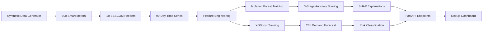

<p align="center">
  
</p>

<h1 align="center">SENTINEL</h1>
<h3 align="center">AI-Powered Smart Grid Anomaly Detection & Demand Forecasting for BESCOM</h3>

<p align="center">
  
  
  
  
  
  
  
</p>

<p align="center">
  <b>Hackathon:</b> AI for Bharat | <b>Track:</b> Smart Infrastructure | <b>Theme:</b> Energy & Utilities
</p>

---

<!-- ============================================================ -->
<!-- PRESENTATION & DEMO LINKS — Replace # with actual URLs       -->
<!-- ============================================================ -->

<p align="center">
  <!-- TODO: Replace with your actual PPT link -->
  <a href="#"></a>
  &nbsp;&nbsp;
  <!-- TODO: Replace with your actual video walkthrough link -->
  <a href="#"></a>
  &nbsp;&nbsp;
  <!-- TODO: Replace with your actual deployed URL -->
  <a href="#"></a>
</p>

---

## The Problem

India's power distribution companies (DISCOMs) like BESCOM lose an estimated **20-25% of generated electricity** to Aggregate Technical & Commercial (AT&C) losses every year. This translates to thousands of crores in revenue leakage caused by:

- **Electricity theft** through meter tampering and illegal bypasses
- **Feeder-level transmission losses** that go undetected for weeks
- **Inaccurate demand forecasting** leading to grid instability and blackouts
- **Peer-deviating consumption** patterns that manual audits simply cannot catch at scale

Traditional detection relies on periodic physical inspections and rule-based threshold alerts, which are **reactive, slow, and fail to catch sophisticated anomalies**.

---

## Our Solution

**SENTINEL** is an end-to-end AI-powered intelligence platform that provides BESCOM with real-time anomaly detection, demand forecasting, and actionable inspection reports — all through a single command-center dashboard.

### How It Works

```
Raw Meter Data ──> Feature Engineering ──> AI Models ──> API Layer ──> Live Dashboard
                        │                      │
                   Time-series         Isolation Forest
                   enrichment          XGBoost Forecast
                   Peer baselines      SHAP Explanations
                   Feeder aggregation  Risk Scoring
```

---

## Key Features

### 1. Three-Stage Anomaly Detection Pipeline

| Stage | Method | What It Catches |
|-------|--------|----------------|
| **Stage 1** | Per-meter Isolation Forest | Individual consumption anomalies (theft, tampering) |
| **Stage 2** | Peer Deviation Analysis | Meters deviating from neighborhood baselines |
| **Stage 3** | Feeder Loss Detection | Aggregate mismatch between feeder supply and meter sum |

A meter is **flagged** only when 2+ stages agree, dramatically reducing false positives.

### 2. XGBoost Demand Forecasting

- Per-feeder hourly demand prediction across **10 BESCOM feeders**
- **15 engineered features** including Fourier transforms, rolling statistics, and lag variables
- Zone-level risk classification: `LOW` / `MEDIUM` / `HIGH` / `CRITICAL`

### 3. Explainable AI with SHAP

Every flagged meter comes with a human-readable explanation powered by SHAP (SHapley Additive exPlanations), telling inspectors **exactly why** the AI flagged it.

### 4. Real-Time Operations Dashboard

- Interactive zone map with anomaly markers (Leaflet.js)
- Demand forecast heatmaps and trend charts (Recharts)
- One-click inspection report generation
- Live system status with auto-refresh

---

## Performance Metrics

### Anomaly Detection

| Metric | Value |
|--------|-------|
| **Precision** | 100% |
| **Recall** | 50.6% |
| **F1 Score** | 67.2% |
| **False Positive Rate** | 0.0% |
| **Total Flagged** | 86 meters |

> Zero false positives ensures that every inspection dispatch is a genuine lead — no wasted field visits.

### Per-Type Detection

| Anomaly Type | Precision | Recall | F1 |
|-------------|-----------|--------|-----|
| Theft | 1.00 | 0.40 | 0.57 |
| Feeder Loss | 0.86 | 0.50 | 0.63 |
| Peer Deviation | 1.00 | 0.13 | 0.22 |

### Demand Forecasting

| Feeder | Locality | RMSE | MAPE | Improvement vs Baseline |
|--------|----------|------|------|------------------------|
| F01 | Jayanagar | 2.14 | 1.49% | **84.7%** |
| F02 | Indiranagar | 3.06 | 1.92% | **76.2%** |
| F03 | Whitefield | 2.38 | 1.67% | **79.5%** |
| F04 | Koramangala | 2.17 | 1.62% | **82.5%** |
| F05 | Hebbal | 2.47 | 1.69% | **78.4%** |
| F06 | Electronic City | 3.04 | 2.08% | **78.9%** |
| F07 | Yelahanka | 2.94 | 1.89% | **80.9%** |
| F08 | Marathahalli | 2.24 | 1.43% | **78.6%** |
| F09 | Rajajinagar | 2.28 | 1.57% | **77.2%** |
| F10 | BTM Layout | 2.95 | 2.28% | **78.7%** |

> Average **79.6% improvement** over the same-hour-day-of-week baseline forecaster.

---

## Tech Stack

| Layer | Technology | Purpose |
|-------|-----------|---------|
| **ML Pipeline** | Python, scikit-learn, XGBoost, SHAP | Model training, anomaly detection, explainability |
| **Data Processing** | Pandas, NumPy, SciPy | Feature engineering, time-series manipulation |
| **API Backend** | FastAPI, Uvicorn | RESTful endpoints serving precomputed results |
| **Frontend** | Next.js 14, React 18, TypeScript | Server-side rendered dashboard |
| **Visualization** | Recharts, React-Leaflet, Framer Motion | Interactive charts, maps, and animations |
| **Styling** | Tailwind CSS | Dark-themed command center UI |
| **Deployment** | Vercel (Frontend + Serverless Python) | Production hosting |

---

## Project Structure

```
sentinel/
├── api/
│   ├── index.py                # FastAPI application (12 endpoints)
│   └── requirements.txt        # Python runtime dependencies
├── app/                        # Next.js 14 App Router pages
│   ├── (shell)/
│   │   ├── dashboard/          # Main command center
│   │   ├── anomalies/          # Anomaly explorer with filters
│   │   ├── forecasting/        # Demand forecasting & heatmaps
│   │   └── reports/            # Inspection report generator
│   ├── layout.tsx              # Root layout
│   └── page.tsx                # Landing page
├── components/                 # Reusable React components
│   ├── AppShell.tsx            # Sidebar navigation
│   ├── ZoneMap.tsx             # Interactive Leaflet map
│   ├── StatCounter.tsx         # Animated metric cards
│   └── ...
├── models/
│   ├── anomaly/
│   │   └── isolation_forest.py # 3-stage anomaly detection + SHAP
│   └── forecasting/
│       ├── xgboost_demand.py   # Per-feeder XGBoost models
│       └── saved_models/       # Serialized model artifacts
├── data/
│   ├── generate_synthetic.py   # Synthetic BESCOM data generator
│   ├── anomaly_results.csv     # Precomputed anomaly flags
│   ├── forecast_metrics.csv    # Model evaluation metrics
│   ├── forecast_next24h.csv    # Next 24-hour predictions
│   └── anomaly_summary.json    # Aggregate detection stats
├── notebooks/
│   └── eda_and_evaluation.ipynb # Exploratory analysis
├── pyproject.toml              # Python project config (uv)
├── uv.lock                    # Locked Python dependencies
├── package.json                # Node.js dependencies
└── vercel.json                 # Deployment routing config
```

---

## API Endpoints

| Endpoint | Method | Description |
|----------|--------|-------------|
| `/api/health` | GET | System health check |
| `/api/dashboard-summary` | GET | Aggregated stats for the main dashboard |
| `/api/anomalies` | GET | List flagged meters (filterable by locality, type, feeder) |
| `/api/anomaly-summary` | GET | Detection statistics and top-5 flagged meters |
| `/api/forecast/zones` | GET | Zone-level risk summary |
| `/api/forecast/feeder/{id}` | GET | Hourly forecast + accuracy for a specific feeder |
| `/api/forecast/accuracy` | GET | All feeder model metrics |
| `/api/forecast/heatmap` | GET | Locality x hour risk matrix |
| `/api/forecast/overview-24h` | GET | Aggregated 24h forecast vs baseline |
| `/api/meters/{meter_id}` | GET | Detailed meter profile + 7-day readings |
| `/api/inspection-report/{meter_id}` | GET | Auto-generated inspection report with evidence |

---

## Getting Started

### Prerequisites

- **Python** 3.10+
- **Node.js** 18+
- **npm** or **yarn**
- **uv** (optional, for faster Python dependency management)

### Installation

```bash
# 1. Clone the repository
git clone https://github.com/darain24/sentinel.git
cd sentinel

# 2. Setup Python environment
python3 -m venv .venv
source .venv/bin/activate        # On Windows: .venv\Scripts\activate
pip install -r requirements.txt

# 3. Generate synthetic BESCOM data
python data/generate_synthetic.py

# 4. Train the demand forecasting models
python models/forecasting/xgboost_demand.py

# 5. Run anomaly detection pipeline
python models/anomaly/isolation_forest.py

# 6. Start the API server
uvicorn api.index:app --reload --port 8000

# 7. In a new terminal — install and start the dashboard
npm install
NEXT_PUBLIC_API_URL=http://127.0.0.1:8000 npm run dev
```

### Open the Dashboard

Navigate to **http://localhost:3000/dashboard** to access the command center.

---

## Deployment

The application is deployed on **Vercel** with:
- **Frontend**: Next.js 14 (Edge-optimized SSR)
- **Backend**: Python Serverless Functions (FastAPI)

To deploy your own instance:

1. Fork this repository
2. Connect it to [Vercel](https://vercel.com)
3. Deploy — Vercel auto-detects Next.js + Python serverless functions

---

## Data Pipeline



---

## Team

| Name | Role | GitHub |
|------|------|--------|
| **Syed Darain Qamar** | Full Stack AI/ML Developer | [@darain24](https://github.com/darain24) |
<!-- Add more team members below -->
<!-- | **Team Member 2** | Role | [@github_handle](https://github.com/handle) | -->
<!-- | **Team Member 3** | Role | [@github_handle](https://github.com/handle) | -->

---

## Future Roadmap

- [ ] Integration with BESCOM's live MDMS (Meter Data Management System)
- [ ] Real-time streaming anomaly detection via Apache Kafka
- [ ] Mobile app for field inspection teams with GPS routing
- [ ] Reinforcement learning for adaptive threshold optimization
- [ ] Multi-language support (Kannada, Hindi, English)
- [ ] Integration with BESCOM's billing system for automated revenue recovery

---

## Acknowledgements

- **BESCOM** for the problem statement and domain context
- **AI for Bharat Hackathon** for the platform
- **scikit-learn**, **XGBoost**, and **SHAP** open-source communities
- **Vercel** for hosting infrastructure

---

<p align="center">
  <b>Built with purpose for Bharat's energy future.</b>
  <br/><br/>
  
  
</p>
